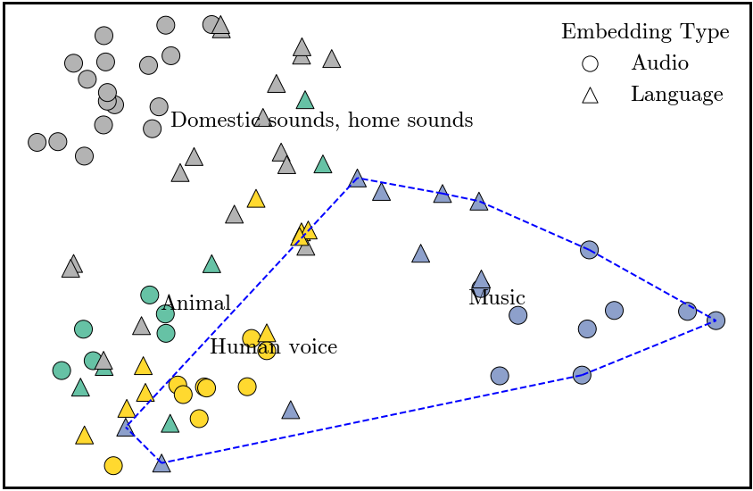
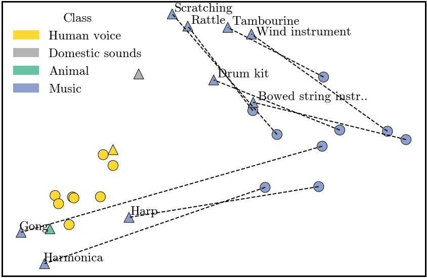
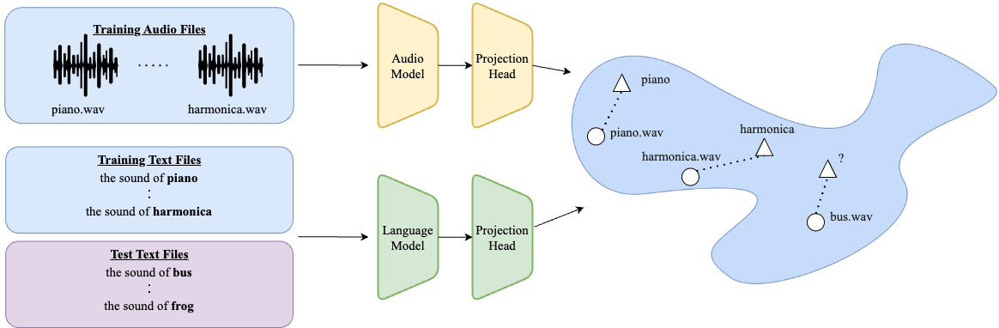
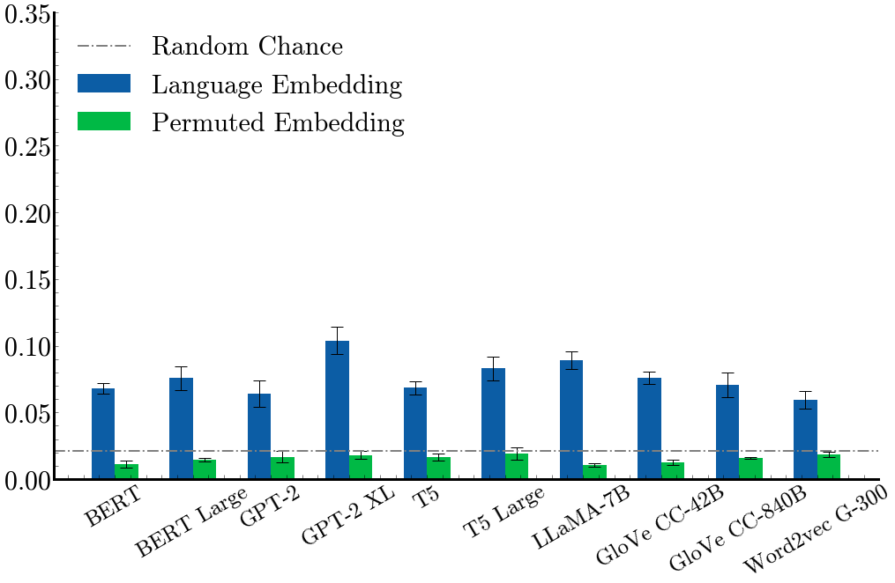
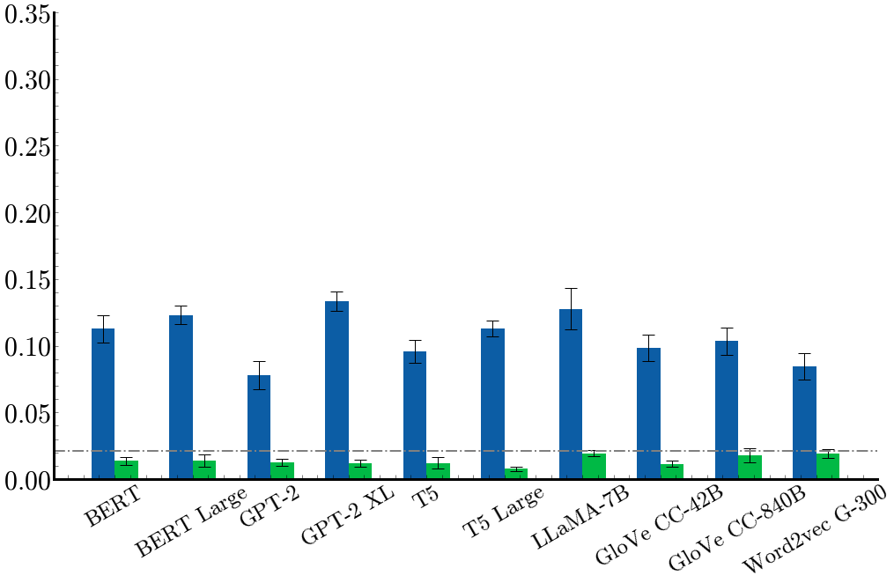
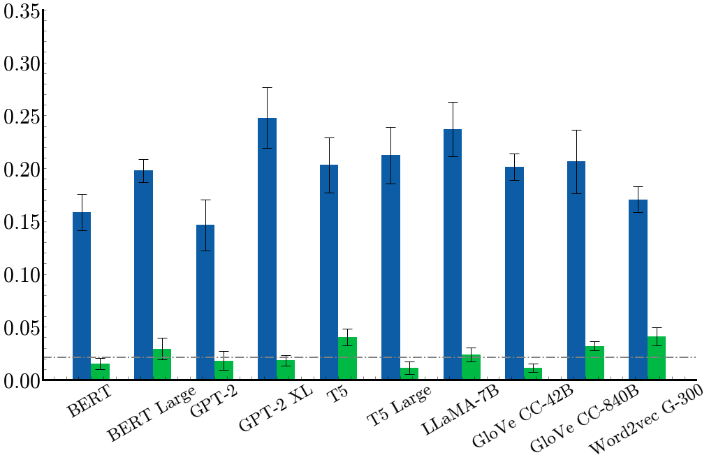
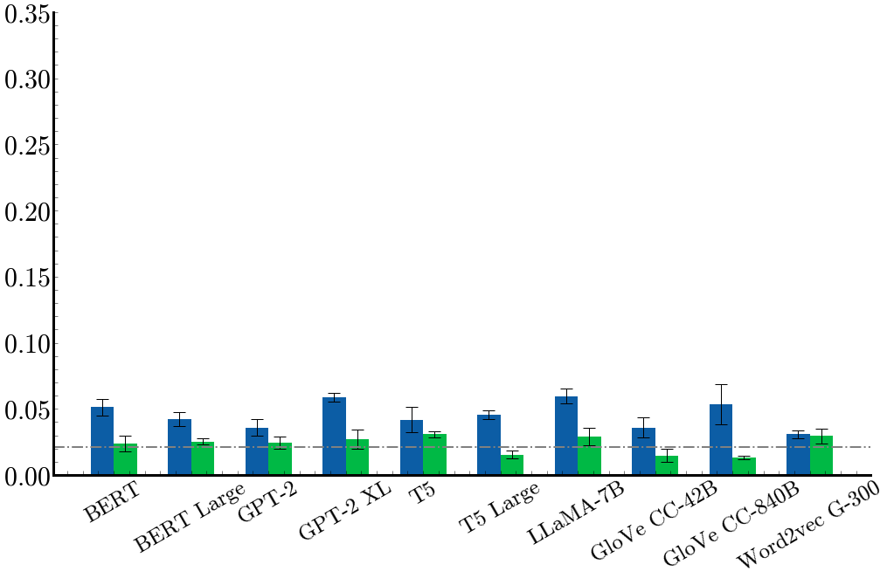

<head>
  <meta charset="utf-8">
  <meta http-equiv="x-ua-compatible" content="ie=edge">
  <meta name="viewport" content="width=device-width">
  <title>What Do Language Models Hear?</title>
  
  
  
</head>

<html>

  <body>
     
    

    What Do Language Models Hear?
     
    Probing for Auditory Representations in Language Models
	

	  
  	<table align=center width=700px>
  	 <tr>
		<td align=center width=100px>
		

			<a href='https://jerryngo.com/'>Jerry Ngo</a>
		

		</td>
		<td align=center width=100px>
		

		<a href='https://people.csail.mit.edu/yoonkim/'>Yoon Kim</a>
		

		</td>
	</tr>
	</table>
	<table align=center width=700px>
  	 <tr>
		<td align=center width=100px>
		

			MIT&nbsp;&nbsp;
		

		</td>
	 </tr>
	</table>

	<table align="center" width="500px" style="margin-top:10px">
		<tbody><tr>
		<td align="center" width="50px">
			

			<a href="https://arxiv.org/abs/2402.16998">[Paper]</a>
			

		</td>
		<td align="center" width="50px">
			

			<a href="">[Code]</a>
			

			</td>
		</tr>
	</tbody></table>

	

    
    
	

	 
	

    Does language models learn meaningfully grounded representations of sounds? 
		As a preliminary study, we aligned language and sound representations using Procrustes analysis then visualized via PCA. The language representation is from BERT and the audio representation is from PaSST. On the right, we show a zoomed-in portion of the blue region of the left figure which shows the structural similarities between the language and sound representations for the music category.
  

	

	<h1 style="margin-top:30px">
Abstract
</h1>
	

		This work explores whether language models encode meaningfully grounded representations of sounds of objects. We learn a linear probe that retrieves the correct text representation of an object given a snippet of audio related to that object, where the sound representation is given by a pretrained audio model.  This probe is trained via a contrastive loss that pushes the language representations and sound representations of an object to be close to one another. After training, the probe is tested on its ability to generalize to objects that were not seen during training. Across different language models and audio models, we find that the probe generalization is above chance in many cases, indicating that despite being trained only on raw text, language models encode grounded knowledge of sounds for some objects.
	

	

	<h1 style="margin-top:30px">
Methodology
</h1>
	

    
	

	 
	

    We randomly split a set of classes into mutually exclusive train/test sets. On the training set (blue), we use a contrastive loss to  learn linear transformations (i.e., projection heads) of the sound and language representations such that a language representation of a class is close in cosine distance to the sound representation of the same class. After training, we apply the learned probe on audio snippets of classes from the test set, and retrieve the most similar text representation (from classes in both the train and test sets). We then test whether the retrieved class corresponds to the actual class. 
  

  

	<h1 style="margin-top:30px">
Main Results
</h1>
	

  	

	    AudioMAE
	    
	  

	  

	    AudioMAE-FT
	   	
	  

	  

	    PaSST
	    
	    <!-- Content for the third cell -->
	  

	  

	    PANN
	    
	    <!-- Content for the fourth cell -->
	  

	

	

   Our main results measure the linear probe accuracy@3 performance for the different language/sound representation combinations. Green bars show the accuracy of the permuted embedding control task, where the text representations are randomly permuted. Error bars show standard error of the mean across 5 runs. Dotted line shows random chance performance, which is 2.08%. We can see that most language models perform well above chance.
  

	

	<h1 style="margin-top:30px">
Acknowledgments
</h1>
	

		This study was partially supported by funds from the MIT-IBM Watson AI Lab.
	

	

	<h1 style="margin-top:30px">
Bibtex
</h1>
	

<pre style="font-size: 10pt; margin: .3em 0px;text-align: left;
      white-space: pre-wrap;       /* Since CSS 2.1 */
      white-space: -moz-pre-wrap;  /* Mozilla, since 1999 */
      white-space: -pre-wrap;      /* Opera 4-6 */
      white-space: -o-pre-wrap;    /* Opera 7 */
      word-wrap: break-word;       /* Internet Explorer 5.5+ */">@article{ngo_what_2024,
  title={What Do Language Models Hear? Probing for Auditory Representations in Language Models},
  journal={arXiv:2402.16998}
  author={Jerry Ngo, Yoon Kim},
  year={2024}
}
</pre>

</body>
</html>